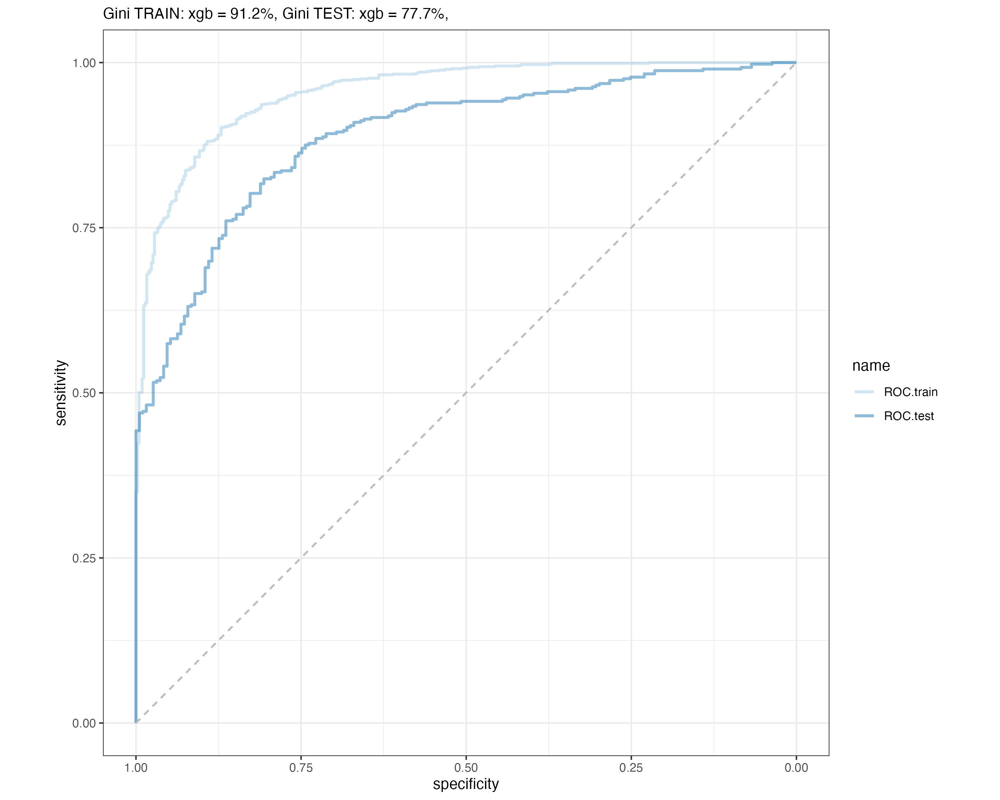

```{r, message=FALSE}
library(dplyr)
library(rpart)
library(rpart.plot)
library(xgboost)
library(plyr)
library(doParallel)
library(pROC)
library(ggplot2)
library(gbm)
library(caret)
library(workflows)
library(parsnip)
library(recipes)
library(dials)
library(rsample)
library(tune)
library(yardstick)
library(DT)

cores=detectCores()
registerDoParallel(cores=cores)
```

```{r setup, include=FALSE}
knitr::opts_chunk$set(echo = TRUE)
```

```{r, include=FALSE}
options(width = 60)
local({
  hook_output <- knitr::knit_hooks$get('output')
  knitr::knit_hooks$set(output = function(x, options) {
    if (!is.null(options$max.height)) options$attr.output <- c(
      options$attr.output,
      sprintf('style="max-height: %s;"', options$max.height)
    )
    hook_output(x, options)
  })
})
```

## Hyperparameter tuning using tidymodels

In this section we tuned hyperparameters using tidymodels and tried to do it in more automated way.

In the first step we tune hyperparameters and take the best model parameters.

We built a function tune_two_stages (defined in a separate script) which takes the 2 grids of parameters and tunes models in two steps. 
Firstly it tunes one parameter, takes the best one and than it goes to the second grid tuning all parameters at the same time.
Results are sorted by -mean value and parameters of three best models are taken and written as csv.

In the second step we take the results and check the performance of the models.

We built the functions summary_xgb, summary_random_forest, summary_decision_tree which takes the 3 best set of parameters and their names and check the performance of the model.
We estimate the models using specific parameters on df.train, make predictions on df.train, df.test and check the performance using GINI and saving roc plots.

```{r}
rm(list=ls())

cores=delightgbmcores=detectCores()
registerDoParallel(cores=cores)

source("./scripts/tune_functions.R")

df <- read.csv("./data/output/df.csv")
df.train <- read.csv("./data/output/df.train.csv")
df.test <- read.csv("./data/output/df.test.csv")

# Make factor
df$class <- factor(df$class, levels = c(0, 1), labels = c("bad", "good"))
df.train$class <- factor(df.train$class, levels = c(0, 1), labels = c("bad", "good"))
df.test$class <- factor(df.test$class, levels = c(0, 1), labels = c("bad", "good"))

# Load rfe columns
rfe_columns <- read.csv("./data/output/rfe_columns.csv")
rfe_columns <- c("class", rfe_columns$x)

# Adjust dfs to have rfe columns
df.train <- df.train[, rfe_columns]
df.test <- df.test[, rfe_columns]
```

### Define models

Define models and their hyperpatemeters to check.

```{r}
# define parameters of models
models <- list(
  xgboost = list(
    model_name = 'xgboost',
    
    model_1 = boost_tree(mode = "classification", engine = "xgboost", learn_rate = tune()),
    
    model_2_args = list(tree_depth = tune(), 
                        loss_reduction = tune(), 
                        trees = tune(),
                        stop_iter = tune(),
                        min_n = tune()),
    
    rec_spec = recipe(class ~ ., df.train),
    
    grid_1 = set_seed_grid(grid_latin_hypercube(learn_rate(), size = 10), 123),
    
    grid_2 = set_seed_grid(as_tibble(expand.grid(
      tree_depth = c(6, 9, 12),
      loss_reduction = c(0.5, 1, 2),
      trees = c(100, 300, 500),
      stop_iter = seq(10, 50, by=10),
      min_n = seq(25, 100, by=25)
    )), 123)
  ),
  random_forest = list(
    model_name = 'random_forest',
    model_1 = rand_forest(mode = "classification", engine = "ranger", mtry = 5, trees = tune()),
    model_2_args = list(min_n = tune()),
    
    rec_spec = recipe(class ~ ., df.train),
    
    grid_1 = set_seed_grid(grid_latin_hypercube(trees(), size = 50), 123),
    
    grid_2 = set_seed_grid(as_tibble(expand.grid(
      min_n = c(75, 100, 150, 300)
    )), 123)
  ),
  decision_tree = list(
    model_name = 'decision_tree',
    model_1 = decision_tree(mode = "classification", engine = "rpart", cost_complexity = tune()),
    model_2_args = list(tree_depth = tune(), min_n = tune()),
    
    rec_spec = recipe(class ~ ., df.train),
    
    grid_1 = set_seed_grid(grid_latin_hypercube(cost_complexity(), size = 10), 123),
    grid_2 = set_seed_grid(as_tibble(expand.grid(
      tree_depth = c(6, 9, 12),
      min_n = seq(25, 100, by=25)
    )), 123)
  )
)
```

### Tune xgb

```{r, message=FALSE, results='hide'}
# xgb tune
result_list_xgb <- list(tune_two_stages(models, "xgboost"))
result_list_xgb <- result_list_xgb[[1]]

# xgb summarise
tuned_params_xgb <- c("trees", "min_n", "tree_depth", "loss_reduction", "stop_iter", "learn_rate")
results <- result_list_xgb$result

final_results_xgb <- summary_xgb(results, tuned_params_xgb)
write.csv(final_results_xgb, "./data/output/xgb/final_results_xgb.csv")

```

### Tune rf

```{r, message=FALSE, results='hide'}
result_list_random_forest <- list(tune_two_stages(models, "random_forest"))
result_list_random_forest <- result_list_random_forest[[1]]

# rf summarise
tuned_params_random_forest <- c("trees", "min_n")
results <- result_list_random_forest$result

final_results_random_forest <- summary_random_forest(results, tuned_params_random_forest)
write.csv(final_results_random_forest, "./data/output/rf/final_results_random_forest.csv")
```

### Tune decision tree

```{r, message=FALSE, results='hide'}
result_decision_tree <- list(tune_two_stages(models, "decision_tree"))
result_decision_tree <- result_decision_tree[[1]]

# decision_tree summarise
tuned_params_decision_tree <- c("cost_complexity", "tree_depth", "min_n")
results <- result_decision_tree$result

final_results_decision_tree <- summary_decision_tree(results, tuned_params_decision_tree)
write.csv(final_results_decision_tree, "./data/output/dt/final_results_decision_tree.csv")
```

### Compare results

```{r}
columns_to_compare <- c("iteration", "gini_train", "gini_test", "models_spec", "model_name")

final_results_xgb_c <- final_results_xgb[, columns_to_compare]
final_results_random_forest_c <- final_results_random_forest[, columns_to_compare]
final_results_decision_tree_c <- final_results_decision_tree[, columns_to_compare]
```

```{r}
final_results_all <- rbind(final_results_xgb_c, final_results_random_forest_c, final_results_decision_tree_c) %>% arrange(-gini_test)
```

```{r, echo=FALSE}
datatable(final_results_all, options = list(
  searching = FALSE,
  pageLength = 10,
  lengthMenu = c(5, 10, 15, 20),
  scrollX = TRUE
), width = "100%")  # Adjust the width as needed
```

Plot ROC for the best model - rf1.

```{r}

```

## Summary

To sum up, we built several ML models using a few techniques. 
Finally, it turned out that the xgb model tuned by "one by one" method is the best with gini 92.1% on the df.train and 77% on df.test.

Random forest model tuned in more automated way, presented in the table above also turned out to have relatively high gini values (91.2% train, 77.7% df.test).

All results are presented in the attached pdf presentation.

Even though we used a few techniques which might increase the models accuracy and efficiency like handling missing values, transforming columns according to their characteristics, feature selection using Recursive Feature Elimination, cross validation, grid search and so on we believe that the accuracy might be even more increased for instance by using over or undersampling, which we did not apply.


